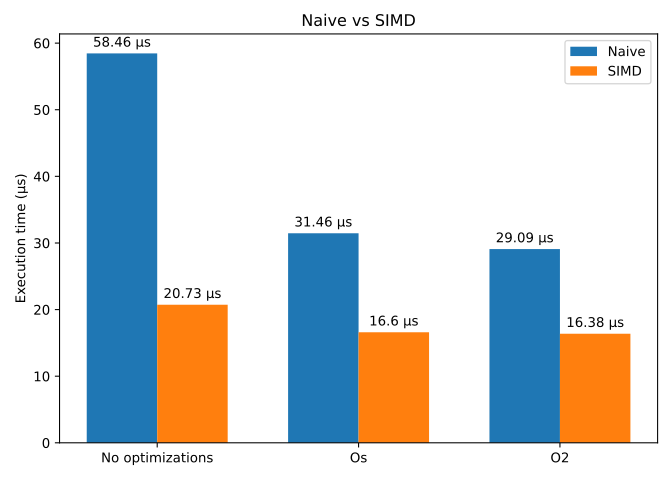

# math

## fib
Outputs the fibonacci of the provided number, utilizing the GMP library to support huge values.

## sqr
Blazingly fast square number generator with a naive and a SIMD version.
### Benchmark
